# Projeto VivaFit

# Gestão de Alunos e Instrutores (ResPartner)
**User Story**

Como administrador da academia,
eu quero cadastrar e gerenciar alunos e instrutores com seus créditos e informações,
para que seja possível controlar participação em aulas, validade de créditos e dados para marketing. 
#

**Impacto**
- Permite identificar quem é aluno ou instrutor
- Permite controle de créditos disponíveis
- Permite acompanhar retenção e comportamento dos alunos
- Permite associar alunos corporativos a centros de custo
#
**Acceptance Criteria**
- O sistema deve permitir marcar um parceiro como:
Aluno
Instrutor
- O sistema deve armazenar:
saldo de créditos do aluno
data de validade dos créditos
- O sistema deve permitir associar o aluno a um:
Centro de custo corporativo
- O sistema deve registrar:
data da última aula realizada
- O sistema deve calcular um NPS médio do aluno

# Gestão de Turmas (StudioClass)
**User Story**

Como gestor da academia,
eu quero criar e gerenciar turmas com modalidade, capacidade e instrutor,
para que as aulas sejam organizadas corretamente e respeitem o limite de alunos.
#

**Impacto**
- Permite organizar agenda de aulas
- Evita superlotação das turmas
- Permite controle de instrutores
- Suporta operação multiempresa 
#

**Acceptance Criteria**
- O sistema deve permitir cadastrar uma turma com:
código da turma
- modalidade da aula
- instrutor responsável
- O sistema deve permitir definir:
capacidade máxima da turma
- O sistema deve calcular automaticamente:
quantidade de vagas ocupadas
- O sistema deve permitir definir:
custo da aula em créditos
- O sistema deve permitir associar a turma a uma:
empresa (multi-company)

# Inscrição em Turmas e Lista de Espera (StudioClassRegistration)
**User Story**

Como aluno,
eu quero me inscrever em turmas disponíveis,
para que eu possa participar das aulas programadas ou entrar na lista de espera caso a turma esteja cheia.
#

**Impacto**
- Permite gerenciar inscrições em aulas
- Evita duplicidade de inscrição
- Permite controle automático de lista de espera
- Garante ordem de prioridade nas vagas

Realização de Aula e Check-in (StudioLesson)
**User Story**

Como instrutor ou recepcionista,
eu quero registrar a presença dos alunos em uma aula,
para que o sistema controle a frequência e o consumo de créditos.

**Impacto**
- Permite controle de presença
- Garante cobrança correta de créditos
- Permite histórico de participação dos alunos
#

**Acceptance Criteria**
O sistema deve permitir registrar alunos presentes na aula
Ao confirmar a presença:
os créditos devem ser debitados automaticamente
O sistema deve validar:

- Se créditos expirados
→ impedir check-in

- Se saldo insuficiente
→ impedir check-in

- O sistema deve registrar:
data da última aula do aluno
- Após confirmação de presença:
o status da aula deve mudar para Realizada

**Acceptance Criteria**
- O sistema deve permitir que um aluno se inscreva em uma turma
- O sistema não deve permitir que:
o mesmo aluno se inscreva duas vezes na mesma turma
- O sistema deve calcular automaticamente o status da inscrição:

- Se vagas disponíveis
→ Confirmado

- Se turma cheia
→ Lista de Espera

- O sistema deve respeitar a ordem de inscrição através do campo sequence

# Realização de Aula e Check-in (StudioLesson)
**User Story**

Como instrutor ou recepcionista,
eu quero registrar a presença dos alunos em uma aula,
para que o sistema controle a frequência e o consumo de créditos.
#

**Impacto**
- Permite controle de presença
- Garante cobrança correta de créditos
- Permite histórico de participação dos alunos
#
**Acceptance Criteria**
- O sistema deve permitir registrar alunos presentes na aula
- Ao confirmar a presença:
os créditos devem ser debitados automaticamente
- O sistema deve validar:

- Se créditos expirados
→ impedir check-in

- Se saldo insuficiente
→ impedir check-in

- O sistema deve registrar:
data da última aula do aluno
Após confirmação de presença:
o status da aula deve mudar para Realizada

# Cancelamento de Aula (StudioLesson)
**User Story**

Como aluno,
eu quero cancelar minha participação em uma aula,
para que eu possa recuperar meus créditos quando cancelar com antecedência.
#

**Impacto**
- Implementa política de cancelamento da academia
- Evita perda injusta de créditos
- Permite melhor gestão de vagas
#

**Acceptance Criteria**
- O sistema deve permitir cancelar uma aula
- Se o cancelamento ocorrer mais de 4 horas antes da aula:
os créditos devem ser devolvidos aos alunos
- Se o cancelamento ocorrer menos de 4 horas antes:
os créditos não devem ser devolvidos
- O status da aula deve mudar para Cancelada

# Faturamento Corporativo (StudioBilling)
**User Story**

Como gestor financeiro,
eu quero gerar relatórios de consumo de créditos por centro de custo,
para que empresas parceiras possam ser faturadas corretamente.
#
**Impacto**
- Permite cobrança de empresas clientes
- Gera transparência no consumo de aulas
- Facilita auditoria e faturamento
#
**Acceptance Criteria**
- O sistema deve permitir gerar um relatório contendo:
empresa
período
centro de custo
- O relatório deve calcular:
total de créditos consumidos
O relatório deve listar:
alunos
datas das aulas realizadas

# Partes realizadas do Teste

- Check-in de alunos é manual; instrutores não têm visibilidade de créditos restantes! **Ok**
- Cancelamentos com menos de 4h devem consumir crédito; acima de 4h devolvem crédito automaticamente! **Ok**
- Turmas têm capacidade; lista de espera promove aluno automaticamente quando um cancela! **Ok**
- Alunos corporativos: faturamento mensal por consumo consolidado, com relatórios por centro de custo! **OK**

## Entidade de relacionamento para visualização

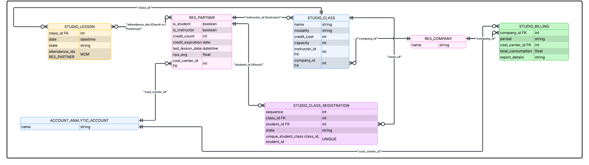

# Realatório de utilização!

- Obs: Passo a Passo!
- **Pagina Principal Nela contem os alunos cadastrados!**

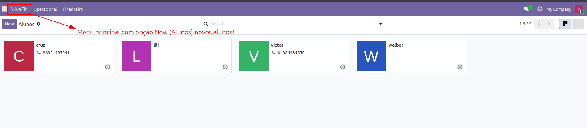

## Operacional com as opções:
- Opção aluno que tem a mesma funcionalidade da pagina principal como cadastrar e marcar opção se é aluno ou istrutor!
- Opção Turma direciona para parte de consulta de turmas, cadastro e edição!
- Opção Diário (Checkin) direciona para aba de Checkin, Cancelamento e agendamento!

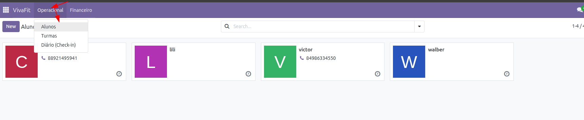

## Cadastro com as opções:
- Nome, email e telefone, opção se é instrutor ou aluno.
- **Aluno tem a opção de Créditos com saldo e validade**

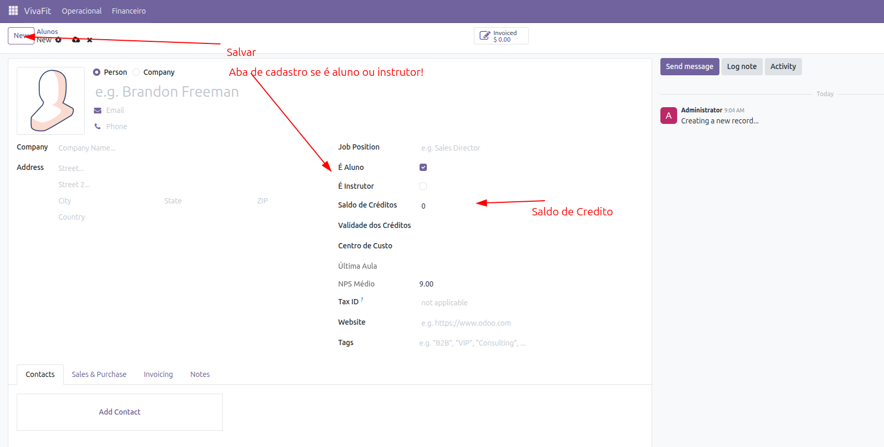

## Turmas com as opções:

- Visão das turmas, Cadastrar nova Turma ou editar alguma turma clicando diretamente na existente!

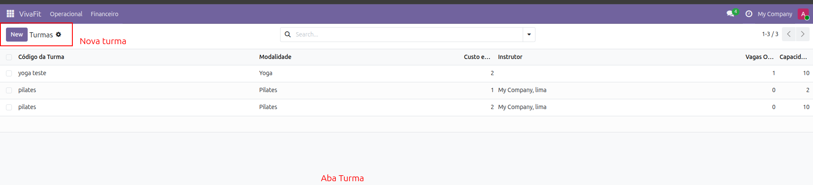
#
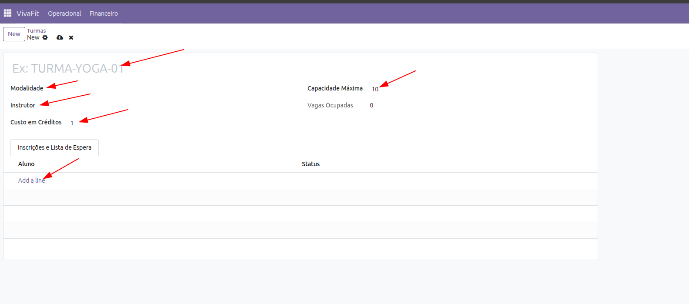

**Obs ao clicar na lista mostra as inscrições e lista de espera como na imagem a seguir!**

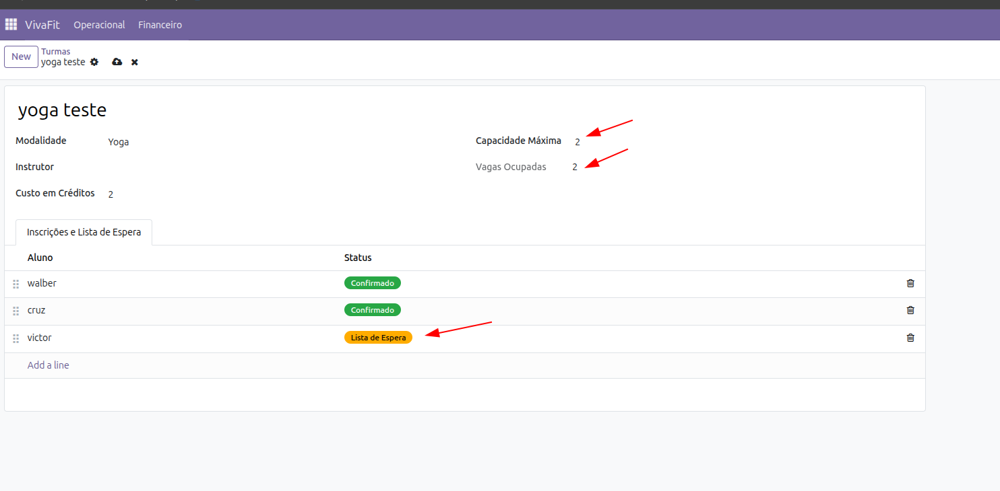

# Diário (Check-in) Têm as opções a seguir:

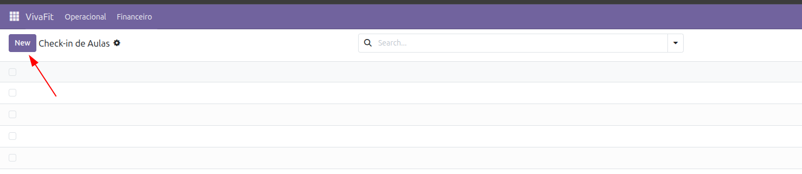

- **Obs ao clicar em novo vai direcionar para proxima tela ->**

- Nessa tela tem as opçoes de Check-in como: Turma, data e hora, confirmar presença, cancelar com a regra das 4h! 

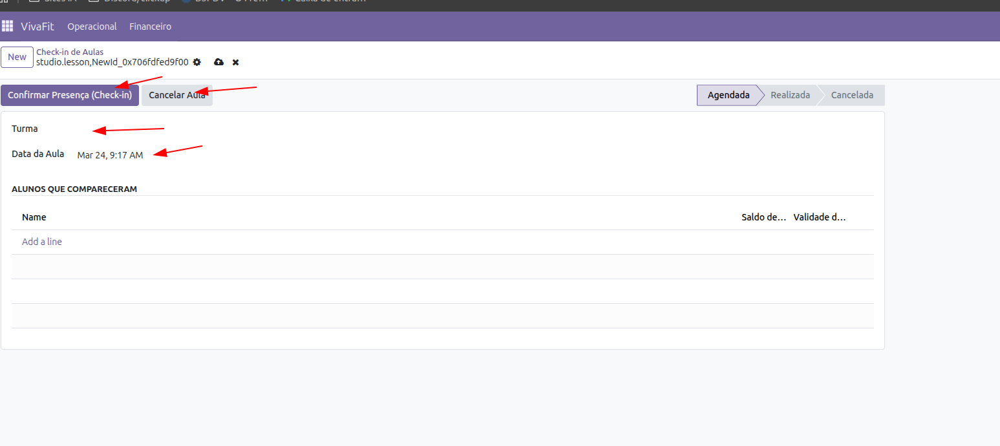

# Relatorio de faturamento!

- **Ao clicar em Faturamento vai direcionar para proxima tela ->**

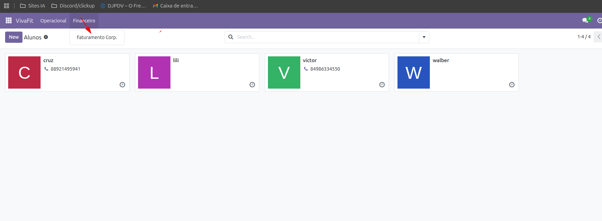

- **Com as opções de filtragem como periodo!**

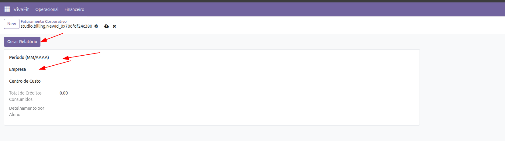