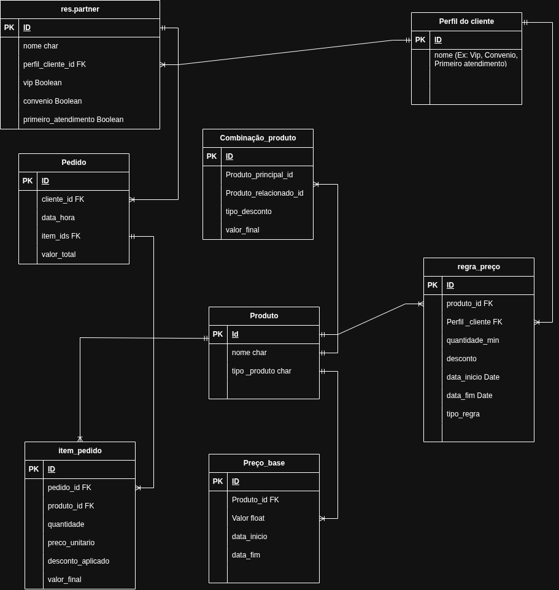

# Projeto Clinica

# User story

- Como administrador da clínica,
quero configurar preços dinâmicos por volume, período e perfil do cliente,
para aumentar o faturamento e melhorar a experiência de compra.
#

#
# Impacto

- Aumento do ticket médio por meio de vendas combinadas
- Fidelização com preços personalizados por perfil
- Redução de erros manuais na aplicação de descontos
- Melhor planejamento de campanhas sazonais
- Maior previsibilidade de receita

# Acceptance Criteria

- O sistema deve permitir cadastrar múltiplos preços para um mesmo procedimento ou produto.

- O sistema deve aplicar automaticamente o preço correto no momento do checkout, considerando:
Quantidade adquirida (volume)
    - Perfil do cliente
    - Período de vigência
    - Combinação de produtos
- O sistema deve permitir configurar datas de início e fim para cada regra de preço.

- O sistema deve permitir diferenciar preços por perfil de cliente, incluindo:
    - Clientes VIP
    - Convênios
    - Primeiro atendimento

- O sistema deve aplicar descontos condicionais para vendas combinadas (bundles), validando automaticamente a presença dos itens necessários no carrinho.

- O sistema deve gerar um documento (PDF ou impressão) contendo a tabela de preços válida para uma data específica.

- O sistema deve permitir filtrar e visualizar preços futuros com base em períodos definidos.

- O sistema deve impedir a aplicação de regras fora do período de vigência.

- O sistema deve exibir ao usuário (recepção) o preço final calculado antes da finalização da venda.